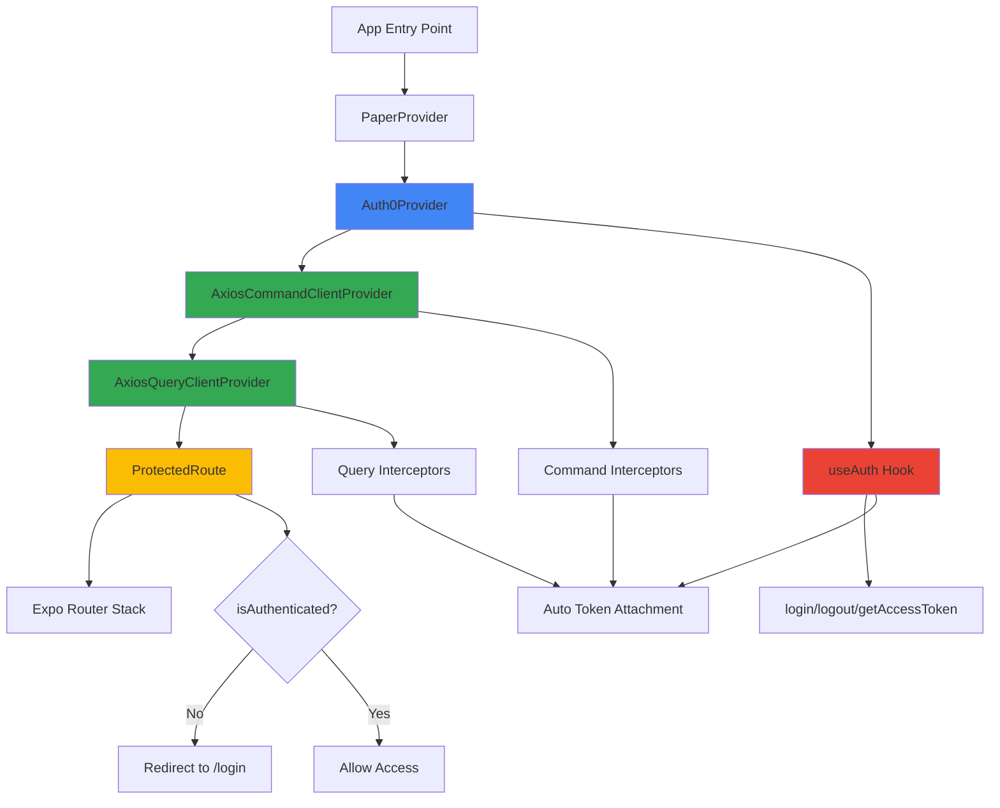

# Auth0 and Axios Implementation Documentation

## Overview

This document describes how Auth0 authentication and Axios HTTP client have been integrated into the `native_expo_paper` React Native application. The implementation follows a provider-based architecture with automatic token management and protected route handling.

---

## Table of Contents

1. [Auth0 Implementation](#auth0-implementation)
2. [Axios Implementation](#axios-implementation)
3. [Integration Architecture](#integration-architecture)
4. [Protected Routes](#protected-routes)
5. [Environment Configuration](#environment-configuration)
6. [Usage Examples](#usage-examples)

---

## Auth0 Implementation

### Dependencies

```json
{
  "react-native-auth0": "^5.4.0"
}
```

### Configuration

#### App Configuration ([app.config.ts](file:///home/thee5176-dev2/Documents/Code/DoubleLedger_Accounting_CQRS/native_expo_paper/app.config.ts))

The Auth0 plugin is configured in the Expo app configuration:

```typescript
plugins: [
  [
    "react-native-auth0",
    {
      domain: process.env.EXPO_PUBLIC_AUTH_DOMAIN,
      customScheme: process.env.EXPO_PUBLIC_AUTH_CUSTOM_SCHEME,
    },
  ],
]
```

#### Provider Setup ([app/_layout.tsx](file:///home/thee5176-dev2/Documents/Code/DoubleLedger_Accounting_CQRS/native_expo_paper/app/_layout.tsx))

The `Auth0Provider` wraps the entire application at the root level:

```tsx
<Auth0Provider
  domain={process.env.EXPO_PUBLIC_AUTH_DOMAIN ?? ""}
  clientId={process.env.EXPO_PUBLIC_AUTH_CLIENT_ID ?? ""}
>
  {/* Application content */}
</Auth0Provider>
```

### Custom Hook: useAuth

Location: [hooks/useAuth.ts](file:///home/thee5176-dev2/Documents/Code/DoubleLedger_Accounting_CQRS/native_expo_paper/hooks/useAuth.ts)

A custom hook that wraps the `react-native-auth0` functionality and provides a simplified API:

```typescript
export const useAuth = () => {
  const {
    user,
    isLoading,
    authorize,
    clearSession,
    getCredentials,
    hasValidCredentials,
  } = useAuth0();

  const login = async () => { /* ... */ };
  const logout = async () => { /* ... */ };
  const getAccessToken = async () => { /* ... */ };

  return {
    user,
    isLoading,
    isAuthenticated: !!user,
    login,
    logout,
    getAccessToken,
    hasValidCredentials,
  };
};
```

#### Key Features:

- **login()**: Initiates the Auth0 authorization flow
- **logout()**: Clears the user session
- **getAccessToken()**: Retrieves the current access token from credentials
- **isAuthenticated**: Computed property based on user existence
- **Error handling**: All methods include try-catch blocks with console logging

---

## Axios Implementation

### Dependencies

```json
{
  "axios": "^1.13.4"
}
```

### Base Configuration

Location: [service/api/index.ts](file:///home/thee5176-dev2/Documents/Code/DoubleLedger_Accounting_CQRS/native_expo_paper/service/api/index.ts)

Two separate Axios instances are created for CQRS architecture:

```typescript
const COMMAND_PATH: string = `${host}/command/`;
const QUERY_PATH: string = `${host}/query/`;

const axiosClient = (endpoint: string) =>
  axios.create({
    baseURL: endpoint == "command" ? COMMAND_PATH : QUERY_PATH,
    timeout: 3000,
    headers: {
      "Content-Type": "application/json",
    },
  });

export const axiosCommandClient = axiosClient("command");
export const axiosQueryClient = axiosClient("query");
```

#### Configuration Details:

- **Base URL**: Determined by `EXPO_PUBLIC_API_URL` environment variable
- **Timeout**: 3000ms (3 seconds)
- **Headers**: JSON content type by default
- **CQRS Pattern**: Separate clients for command and query operations

### Token Management

A utility function sets the Authorization header across all Axios instances:

```typescript
export function setAuthToken(token?: string | null) {
  const header = `Bearer ${token}`;
  axios.defaults.headers.common["Authorization"] = header;
  axiosCommandClient.defaults.headers.common["Authorization"] = header;
  axiosQueryClient.defaults.headers.common["Authorization"] = header;
}
```

---

## Integration Architecture

### Provider Hierarchy

The application uses a nested provider structure in [app/_layout.tsx](file:///home/thee5176-dev2/Documents/Code/DoubleLedger_Accounting_CQRS/native_expo_paper/app/_layout.tsx):

```tsx
<PaperProvider theme={theme.light}>
  <Auth0Provider domain="..." clientId="...">
    <AxiosCommandClientProvider>
      <AxiosQueryClientProvider>
        <ProtectedRoute>
          <Stack>{/* Routes */}</Stack>
        </ProtectedRoute>
      </AxiosQueryClientProvider>
    </AxiosCommandClientProvider>
  </Auth0Provider>
</PaperProvider>
```

### Axios Provider Components

#### AxiosCommandClientProvider

Location: [service/api/command.tsx](file:///home/thee5176-dev2/Documents/Code/DoubleLedger_Accounting_CQRS/native_expo_paper/service/api/command.tsx)

Manages authentication for command API requests using Axios interceptors:

**Request Interceptor:**
- Checks if user is authenticated
- Retrieves access token from Auth0 credentials
- Attaches `Bearer` token to Authorization header
- Logs authentication status for debugging

**Response Interceptor:**
- Handles 401 (Unauthorized) errors
- Handles 403 (Forbidden) errors
- Logs error status for debugging

```typescript
useEffect(() => {
  const isAuthenticated = !!user;

  const requestCommandInterceptor = 
    axiosCommandClient.interceptors.request.use(async (config) => {
      if (isAuthenticated && !isLoading) {
        const credentials = await getCredentials();
        const token = credentials?.accessToken;
        if (token) {
          config.headers.Authorization = `Bearer ${token}`;
        }
      }
      return config;
    });

  const responseCommandInterceptor = 
    axiosCommandClient.interceptors.response.use(
      (response) => response,
      (error) => {
        // Handle 401, 403 errors
        return Promise.reject(error);
      }
    );

  return () => {
    axiosCommandClient.interceptors.request.eject(requestCommandInterceptor);
    axiosCommandClient.interceptors.response.eject(responseCommandInterceptor);
  };
}, [user, isLoading, getCredentials]);
```

#### AxiosQueryClientProvider

Location: [service/api/query.tsx](file:///home/thee5176-dev2/Documents/Code/DoubleLedger_Accounting_CQRS/native_expo_paper/service/api/query.tsx)

Identical implementation to `AxiosCommandClientProvider` but for the query client. This separation maintains the CQRS pattern and allows independent configuration if needed.

**Key Features:**
- Automatic token attachment for authenticated requests
- Token refresh on user state changes
- Cleanup of interceptors on unmount
- Separate error handling for query operations

---

## Protected Routes

### ProtectedRoute Component

Location: [components/ProtectedRoute.tsx](file:///home/thee5176-dev2/Documents/Code/DoubleLedger_Accounting_CQRS/native_expo_paper/components/ProtectedRoute.tsx)

Implements route protection and automatic navigation based on authentication status:

```typescript
export function ProtectedRoute({ children }: ProtectedRouteProps) {
  const { isAuthenticated, isLoading } = useAuth();
  const segments = useSegments();
  const router = useRouter();

  useEffect(() => {
    if (isLoading) return;

    const currentRoute = segments[0];
    const publicRoutes = ["login", "+not-found"];
    const isPublicRoute = publicRoutes.includes(currentRoute);

    if (!isAuthenticated && !isPublicRoute) {
      router.replace("/login");
    } else if (isAuthenticated && currentRoute === "login") {
      router.replace("/account");
    }
  }, [isAuthenticated, segments, isLoading, router]);

  if (isLoading) {
    return <ActivityIndicator size="large" />;
  }

  return <>{children}</>;
}
```

#### Behavior:

1. **Loading State**: Shows activity indicator while Auth0 initializes
2. **Unauthenticated Access**: Redirects to `/login` when accessing protected routes
3. **Authenticated on Login Page**: Redirects to `/account` when already logged in
4. **Public Routes**: `login` and `+not-found` are accessible without authentication

---

## Environment Configuration

### Required Environment Variables

Create a `.env` file in the project root with the following variables:

```env
# Auth0 Configuration
EXPO_PUBLIC_AUTH_DOMAIN=your-tenant.auth0.com
EXPO_PUBLIC_AUTH_CLIENT_ID=your-client-id
EXPO_PUBLIC_AUTH_CUSTOM_SCHEME=your-app-scheme

# API Configuration
EXPO_PUBLIC_API_URL=https://your-api-url.com
```

### Environment Variable Usage

| Variable | Purpose | Used In |
|----------|---------|---------|
| `EXPO_PUBLIC_AUTH_DOMAIN` | Auth0 tenant domain | [app.config.ts](file:///home/thee5176-dev2/Documents/Code/DoubleLedger_Accounting_CQRS/native_expo_paper/app.config.ts), [app/_layout.tsx](file:///home/thee5176-dev2/Documents/Code/DoubleLedger_Accounting_CQRS/native_expo_paper/app/_layout.tsx) |
| `EXPO_PUBLIC_AUTH_CLIENT_ID` | Auth0 application client ID | [app/_layout.tsx](file:///home/thee5176-dev2/Documents/Code/DoubleLedger_Accounting_CQRS/native_expo_paper/app/_layout.tsx) |
| `EXPO_PUBLIC_AUTH_CUSTOM_SCHEME` | Deep linking scheme for OAuth callback | [app.config.ts](file:///home/thee5176-dev2/Documents/Code/DoubleLedger_Accounting_CQRS/native_expo_paper/app.config.ts) |
| `EXPO_PUBLIC_API_URL` | Backend API base URL | [service/api/index.ts](file:///home/thee5176-dev2/Documents/Code/DoubleLedger_Accounting_CQRS/native_expo_paper/service/api/index.ts) |

---

## Usage Examples

### Login Screen Implementation

Location: [app/login.tsx](file:///home/thee5176-dev2/Documents/Code/DoubleLedger_Accounting_CQRS/native_expo_paper/app/login.tsx)

```tsx
export default function LoginScreen() {
  const { login, logout, user, isLoading, getAccessToken } = useAuth();

  const onLogin = async () => {
    try {
      await login();
      const token = await getAccessToken();
      console.log("Logged in:", user);
      console.log("Access Token:", token);
    } catch (e) {
      console.log(e);
    }
  };

  const onLogout = async () => {
    try {
      await logout();
      console.log("Logged out");
    } catch (e) {
      console.log("Log out cancelled");
    }
  };

  return (
    <View>
      {!user ? (
        <Button onPress={onLogin} loading={isLoading}>
          Log In with Auth0
        </Button>
      ) : (
        <Button onPress={onLogout} loading={isLoading}>
          Log Out
        </Button>
      )}
    </View>
  );
}
```

### Making Authenticated API Calls

Since the Axios interceptors automatically attach tokens, you can make API calls directly:

```typescript
import { axiosQueryClient, axiosCommandClient } from '@/service/api';

// Query example (GET)
const fetchData = async () => {
  try {
    const response = await axiosQueryClient.get('/endpoint');
    return response.data;
  } catch (error) {
    console.error('Query failed:', error);
  }
};

// Command example (POST)
const submitData = async (data: any) => {
  try {
    const response = await axiosCommandClient.post('/endpoint', data);
    return response.data;
  } catch (error) {
    console.error('Command failed:', error);
  }
};
```

The interceptors will automatically:
1. Check if the user is authenticated
2. Retrieve the current access token
3. Attach it to the Authorization header
4. Handle authentication errors

---

## Architecture Diagram



---

## Key Design Decisions

### 1. **Provider-Based Architecture**
- Ensures Auth0 context is available throughout the app
- Axios interceptors have access to authentication state
- Clean separation of concerns

### 2. **CQRS Pattern**
- Separate Axios clients for commands and queries
- Allows independent configuration and monitoring
- Aligns with backend architecture

### 3. **Automatic Token Management**
- Interceptors handle token attachment automatically
- No manual token management in components
- Tokens refresh when user state changes

### 4. **Protected Route Component**
- Centralized authentication logic
- Automatic redirects based on auth state
- Loading state handling

### 5. **Custom useAuth Hook**
- Simplified API for components
- Consistent error handling
- Easy to test and mock

---

## Security Considerations

1. **Token Storage**: Tokens are managed by `react-native-auth0` using secure storage
2. **HTTPS Only**: All API calls should use HTTPS in production
3. **Token Expiration**: Auth0 handles token refresh automatically
4. **Error Handling**: 401/403 errors are logged but don't expose sensitive information
5. **Environment Variables**: Sensitive configuration is stored in environment variables

---

## Troubleshooting

### Common Issues

**Issue**: "Failed to acquire Auth0 token"
- **Cause**: Auth0 is still initializing or credentials are unavailable
- **Solution**: Ensure `isLoading` is false before making API calls

**Issue**: API calls return 401 Unauthorized
- **Cause**: Token is expired or invalid
- **Solution**: Check Auth0 configuration and ensure user is logged in

**Issue**: Infinite redirect loop
- **Cause**: Protected route logic conflict
- **Solution**: Verify public routes array in `ProtectedRoute.tsx`

### Debug Logging

The implementation includes extensive console logging:
- Token attachment status
- Authentication state changes
- API error responses
- Login/logout events

Check the console for detailed information during development.

---

## Future Enhancements

1. **Token Refresh Logic**: Implement automatic token refresh before expiration
2. **Offline Support**: Cache tokens for offline API calls
3. **Error Boundaries**: Add error boundaries for authentication failures
4. **Analytics**: Track authentication events
5. **Multi-tenant Support**: Support multiple Auth0 tenants

---

## References

- [React Native Auth0 Documentation](https://github.com/auth0/react-native-auth0)
- [Axios Documentation](https://axios-http.com/)
- [Expo Router Documentation](https://docs.expo.dev/router/introduction/)
- [Auth0 React Native Quickstart](https://auth0.com/docs/quickstart/native/react-native)

---

**Last Updated**: 2026-01-29  
**Version**: 1.0.0
