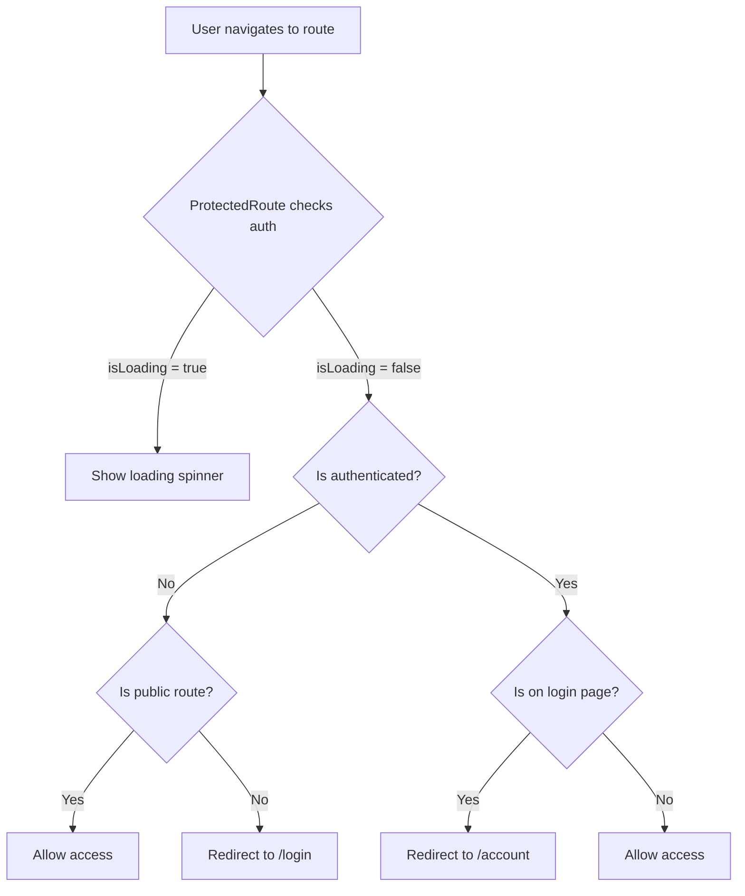

# Protected Routes Implementation Guide

This document explains the implementation of protected routes in the Expo React Native application using Auth0 authentication and Expo Router.

## Table of Contents

1. [Overview](#overview)
2. [Architecture](#architecture)
3. [Implementation Components](#implementation-components)
4. [Setup and Configuration](#setup-and-configuration)
5. [Usage Examples](#usage-examples)
6. [Route Protection Logic](#route-protection-logic)
7. [Best Practices](#best-practices)
8. [Troubleshooting](#troubleshooting)

---

## Overview

Protected routes ensure that only authenticated users can access certain parts of the application. This implementation uses:

- **Auth0** for authentication
- **Expo Router** for file-based routing
- **Custom `ProtectedRoute` component** for route guarding
- **`useAuth` hook** for authentication state management

### Key Features

- ✅ Automatic redirect to login for unauthenticated users
- ✅ Redirect authenticated users away from login page
- ✅ Loading state handling during authentication checks
- ✅ Public route configuration (login, 404)
- ✅ Seamless integration with Expo Router navigation

---

## Architecture

### Component Hierarchy

```
RootLayout (_layout.tsx)
├── PaperProvider (UI theming)
│   └── Auth0Provider (authentication)
│       └── AxiosCommandClientProvider (API commands)
│           └── AxiosQueryClientProvider (API queries)
│               └── ProtectedRoute (route guard)
│                   └── Stack (navigation)
│                       ├── login (public)
│                       ├── account (protected)
│                       ├── modal (protected)
│                       └── +not-found (public)
```

### Data Flow



---

## Implementation Components

### 1. ProtectedRoute Component

**Location**: [`components/ProtectedRoute.tsx`](file:///home/thee5176-dev2/Documents/Code/DoubleLedger_Accounting_CQRS/native_expo_paper/components/ProtectedRoute.tsx)

This component wraps the entire navigation stack and handles route protection logic.

```tsx
import { useRouter, useSegments } from "expo-router";
import { useEffect } from "react";
import { View } from "react-native";
import { ActivityIndicator } from "react-native-paper";
import { useAuth } from "../hooks/useAuth";
import theme from "../theme";

interface ProtectedRouteProps {
  children: React.ReactNode;
}

export function ProtectedRoute({ children }: ProtectedRouteProps) {
  const { isAuthenticated, isLoading } = useAuth();
  const segments = useSegments();
  const router = useRouter();

  useEffect(() => {
    if (isLoading) return;

    const currentRoute = segments[0];

    // Define public routes that don't require authentication
    const publicRoutes = ["login", "+not-found"];
    const isPublicRoute = publicRoutes.includes(currentRoute);

    // Redirect logic
    if (!isAuthenticated && !isPublicRoute) {
      // User is not authenticated and trying to access a protected route
      router.replace("/login");
    } else if (isAuthenticated && currentRoute === "login") {
      // User is authenticated but on the login page
      router.replace("/account");
    }
  }, [isAuthenticated, segments, isLoading, router]);

  // Show loading spinner while checking authentication
  if (isLoading) {
    return (
      <View
        style={{
          flex: 1,
          justifyContent: "center",
          alignItems: "center",
          backgroundColor: theme.dark.colors.background,
        }}
      >
        <ActivityIndicator size="large" />
      </View>
    );
  }

  return <>{children}</>;
}
```

#### Key Features:

- **`useSegments()`**: Gets the current route segments from Expo Router
- **`useAuth()`**: Custom hook providing authentication state
- **Loading State**: Shows spinner while checking authentication
- **Public Routes**: Configurable list of routes accessible without authentication
- **Automatic Redirects**: Handles both authenticated and unauthenticated scenarios

---

### 2. useAuth Hook

**Location**: [`hooks/useAuth.ts`](file:///home/thee5176-dev2/Documents/Code/DoubleLedger_Accounting_CQRS/native_expo_paper/hooks/useAuth.ts)

A custom hook that wraps Auth0's `useAuth0` hook and provides a simplified interface.

```tsx
import { useAuth0 } from "react-native-auth0";

export const useAuth = () => {
  const {
    user,
    isLoading,
    authorize,
    clearSession,
    getCredentials,
    hasValidCredentials,
  } = useAuth0();

  const login = async () => {
    try {
      await authorize();
    } catch (e) {
      console.log("Login cancelled or failed", e);
    }
  };

  const logout = async () => {
    try {
      await clearSession();
    } catch (e) {
      console.log("Logout cancelled or failed", e);
    }
  };

  const getAccessToken = async () => {
    try {
      const credentials = await getCredentials();
      return credentials?.accessToken;
    } catch (e) {
      console.error(e);
      return null;
    }
  };

  return {
    user,
    isLoading,
    isAuthenticated: !!user,
    login,
    logout,
    getAccessToken,
    hasValidCredentials,
  };
};
```

#### Exposed Properties:

- **`user`**: Current user object (null if not authenticated)
- **`isLoading`**: Boolean indicating authentication check in progress
- **`isAuthenticated`**: Computed boolean (`!!user`)
- **`login()`**: Initiates Auth0 login flow
- **`logout()`**: Clears Auth0 session
- **`getAccessToken()`**: Retrieves access token for API calls
- **`hasValidCredentials`**: Checks if credentials are still valid

---

### 3. Root Layout Configuration

**Location**: [`app/_layout.tsx`](file:///home/thee5176-dev2/Documents/Code/DoubleLedger_Accounting_CQRS/native_expo_paper/app/_layout.tsx)

The root layout sets up all providers and wraps the navigation stack with `ProtectedRoute`.

```tsx
import { ProtectedRoute } from "@/components/ProtectedRoute";
import { AxiosCommandClientProvider } from "@/service/api/command";
import { AxiosQueryClientProvider } from "@/service/api/query";
import theme from "@/theme";
import { Stack } from "expo-router";
import { Auth0Provider } from "react-native-auth0";
import { PaperProvider } from "react-native-paper";

export default function RootLayout() {
  return (
    <PaperProvider theme={theme.dark}>
      <Auth0Provider
        domain={process.env.EXPO_PUBLIC_AUTH_DOMAIN ?? ""}
        clientId={process.env.EXPO_PUBLIC_AUTH_CLIENT_ID ?? ""}
      >
        <AxiosCommandClientProvider>
          <AxiosQueryClientProvider>
            <ProtectedRoute>
              <Stack>
                <Stack.Screen
                  name="login"
                  options={{ title: "Login", headerShown: false }}
                />
                <Stack.Screen name="account" options={{ headerShown: false }} />
                <Stack.Screen
                  name="modal"
                  options={{ presentation: "modal" }}
                />
                <Stack.Screen name="+not-found" options={{ title: "Oops!" }} />
              </Stack>
            </ProtectedRoute>
          </AxiosQueryClientProvider>
        </AxiosCommandClientProvider>
      </Auth0Provider>
    </PaperProvider>
  );
}
```

#### Provider Order (Important!):

1. **PaperProvider**: UI theming (outermost)
2. **Auth0Provider**: Authentication context
3. **AxiosCommandClientProvider**: API command client
4. **AxiosQueryClientProvider**: API query client
5. **ProtectedRoute**: Route guard
6. **Stack**: Navigation (innermost)

---

## Setup and Configuration

### 1. Environment Variables

Create a `.env` file in the project root:

```env
EXPO_PUBLIC_AUTH_DOMAIN=your-auth0-domain.auth0.com
EXPO_PUBLIC_AUTH_CLIENT_ID=your-auth0-client-id
EXPO_PUBLIC_AUTH_CUSTOM_SCHEME=myapp
EXPO_PUBLIC_API_URL=https://api.example.com
```

### 2. Install Dependencies

```bash
npx expo install react-native-auth0
npx expo install expo-router
npx expo install react-native-paper
```

### 3. Auth0 Configuration

1. Create an Auth0 application (Native)
2. Configure **Allowed Callback URLs**: `myapp://auth0.callback`
3. Configure **Allowed Logout URLs**: `myapp://auth0.logout`
4. Enable **Refresh Token Rotation**
5. Set **Token Endpoint Authentication Method**: None (for native apps)

### 4. File Structure

```
app/
├── _layout.tsx              # Root layout with providers
├── login.tsx                # Public login screen
├── account/                 # Protected account section
│   ├── _layout.tsx          # Account layout (tabs/drawer)
│   └── index.tsx            # Account home
├── modal.tsx                # Protected modal
└── +not-found.tsx           # Public 404 page

components/
└── ProtectedRoute.tsx       # Route guard component

hooks/
└── useAuth.ts               # Authentication hook
```

---

## Usage Examples

### Example 1: Login Screen (Public Route)

**`app/login.tsx`**:

```tsx
import { View, StyleSheet } from "react-native";
import { Button, Text } from "react-native-paper";
import { useAuth } from "@/hooks/useAuth";

export default function LoginScreen() {
  const { login, isLoading } = useAuth();

  return (
    <View style={styles.container}>
      <Text variant="headlineLarge">Welcome</Text>
      <Button mode="contained" onPress={login} loading={isLoading}>
        Login with Auth0
      </Button>
    </View>
  );
}

const styles = StyleSheet.create({
  container: {
    flex: 1,
    justifyContent: "center",
    alignItems: "center",
    padding: 20,
  },
});
```

### Example 2: Protected Account Screen

**`app/account/index.tsx`**:

```tsx
import { View, StyleSheet } from "react-native";
import { Button, Text } from "react-native-paper";
import { useAuth } from "@/hooks/useAuth";

export default function AccountScreen() {
  const { user, logout } = useAuth();

  return (
    <View style={styles.container}>
      <Text variant="headlineMedium">Account</Text>
      <Text>Welcome, {user?.name}!</Text>
      <Text>Email: {user?.email}</Text>
      <Button mode="outlined" onPress={logout}>
        Logout
      </Button>
    </View>
  );
}

const styles = StyleSheet.create({
  container: {
    flex: 1,
    padding: 20,
  },
});
```

### Example 3: Using Access Token for API Calls

```tsx
import { useAuth } from "@/hooks/useAuth";
import { useEffect, useState } from "react";

export default function DataScreen() {
  const { getAccessToken } = useAuth();
  const [data, setData] = useState(null);

  useEffect(() => {
    async function fetchData() {
      const token = await getAccessToken();

      const response = await fetch("https://api.example.com/data", {
        headers: {
          Authorization: `Bearer ${token}`,
        },
      });

      const result = await response.json();
      setData(result);
    }

    fetchData();
  }, []);

  return (
    // Render data
  );
}
```

---

## Route Protection Logic

### Public Routes Configuration

To add a new public route, update the `publicRoutes` array in `ProtectedRoute.tsx`:

```tsx
const publicRoutes = ["login", "+not-found", "privacy-policy", "terms"];
```

### Protected Routes

All routes **not** in the `publicRoutes` array are automatically protected. No additional configuration needed.

### Redirect Behavior

| User State        | Current Route   | Action                 |
| ----------------- | --------------- | ---------------------- |
| Not authenticated | Protected route | Redirect to `/login`   |
| Not authenticated | Public route    | Allow access           |
| Authenticated     | `/login`        | Redirect to `/account` |
| Authenticated     | Protected route | Allow access           |
| Loading           | Any route       | Show loading spinner   |

---

## Best Practices

### 1. Loading State Management

Always show a loading indicator while authentication state is being determined:

```tsx
if (isLoading) {
  return <ActivityIndicator />;
}
```

### 2. Use `router.replace()` Instead of `router.push()`

This prevents users from navigating back to protected routes after logout:

```tsx
// Good
router.replace("/login");

// Bad - allows back navigation
router.push("/login");
```

### 3. Secure Token Storage

Auth0 automatically handles secure token storage using:

- **iOS**: Keychain
- **Android**: Keystore
- **Web**: Secure cookies

### 4. Token Refresh

Enable **Refresh Token Rotation** in Auth0 to automatically refresh expired tokens:

```tsx
const { hasValidCredentials } = useAuth();

// Check before making API calls
if (await hasValidCredentials()) {
  const token = await getAccessToken();
  // Make API call
}
```

### 5. Error Handling

Always handle authentication errors gracefully:

```tsx
const login = async () => {
  try {
    await authorize();
  } catch (e) {
    if (e.error === "a0.session.user_cancelled") {
      // User cancelled login
    } else {
      // Show error message
      Alert.alert("Login Failed", e.message);
    }
  }
};
```

### 6. Deep Linking with Protected Routes

Ensure deep links respect authentication:

```tsx
// In ProtectedRoute.tsx
useEffect(() => {
  if (isLoading) return;

  const currentRoute = segments.join("/");

  // Store intended destination
  if (!isAuthenticated && !isPublicRoute) {
    // Save currentRoute to redirect after login
    AsyncStorage.setItem("redirectAfterLogin", currentRoute);
    router.replace("/login");
  }
}, [isAuthenticated, segments, isLoading]);
```

---

## Troubleshooting

### Issue: Infinite Redirect Loop

**Symptom**: App keeps redirecting between login and protected routes.

**Solution**: Ensure `isLoading` is properly handled:

```tsx
useEffect(() => {
  if (isLoading) return; // Critical: wait for auth check to complete
  // ... redirect logic
}, [isAuthenticated, segments, isLoading]);
```

### Issue: User Object is Null After Login

**Symptom**: `user` is null even after successful login.

**Solution**: Check Auth0 configuration:

1. Verify `domain` and `clientId` in `.env`
2. Ensure callback URLs are configured in Auth0 dashboard
3. Check that `authorize()` completes successfully

### Issue: Access Token Expired

**Symptom**: API calls fail with 401 Unauthorized.

**Solution**: Implement token refresh:

```tsx
const getAccessToken = async () => {
  try {
    const credentials = await getCredentials();

    // Check if token is expired
    if (credentials?.expiresAt && credentials.expiresAt < Date.now()) {
      // Token expired, Auth0 will automatically refresh
      const newCredentials = await getCredentials();
      return newCredentials?.accessToken;
    }

    return credentials?.accessToken;
  } catch (e) {
    console.error(e);
    return null;
  }
};
```

### Issue: Protected Routes Accessible Without Login

**Symptom**: Users can access protected routes without authentication.

**Solution**: Verify `ProtectedRoute` wraps the `Stack`:

```tsx
// Correct
<ProtectedRoute>
  <Stack>
    {/* routes */}
  </Stack>
</ProtectedRoute>

// Incorrect
<Stack>
  <ProtectedRoute>
    {/* routes */}
  </ProtectedRoute>
</Stack>
```

---

## Advanced Patterns

### Role-Based Access Control (RBAC)

Extend `ProtectedRoute` to check user roles:

```tsx
export function ProtectedRoute({
  children,
  requiredRole,
}: ProtectedRouteProps) {
  const { isAuthenticated, isLoading, user } = useAuth();
  const segments = useSegments();
  const router = useRouter();

  useEffect(() => {
    if (isLoading) return;

    const currentRoute = segments[0];
    const publicRoutes = ["login", "+not-found"];
    const isPublicRoute = publicRoutes.includes(currentRoute);

    if (!isAuthenticated && !isPublicRoute) {
      router.replace("/login");
    } else if (isAuthenticated && currentRoute === "login") {
      router.replace("/account");
    } else if (requiredRole && !user?.roles?.includes(requiredRole)) {
      // User doesn't have required role
      router.replace("/unauthorized");
    }
  }, [isAuthenticated, segments, isLoading, user, requiredRole]);

  // ... rest of component
}
```

### Per-Route Protection

For fine-grained control, create route-specific guards:

```tsx
// components/AdminRoute.tsx
export function AdminRoute({ children }: { children: React.ReactNode }) {
  const { user } = useAuth();
  const router = useRouter();

  useEffect(() => {
    if (!user?.roles?.includes("admin")) {
      router.replace("/unauthorized");
    }
  }, [user]);

  return <>{children}</>;
}

// app/admin/_layout.tsx
export default function AdminLayout() {
  return (
    <AdminRoute>
      <Stack>{/* admin routes */}</Stack>
    </AdminRoute>
  );
}
```

---

## Summary

This protected routes implementation provides:

✅ **Secure authentication** using Auth0  
✅ **Automatic route protection** with minimal configuration  
✅ **Seamless user experience** with loading states and redirects  
✅ **Type-safe** authentication state management  
✅ **Scalable architecture** for complex applications

### Key Files:

- [`components/ProtectedRoute.tsx`](file:///home/thee5176-dev2/Documents/Code/DoubleLedger_Accounting_CQRS/native_expo_paper/components/ProtectedRoute.tsx) - Route guard logic
- [`hooks/useAuth.ts`](file:///home/thee5176-dev2/Documents/Code/DoubleLedger_Accounting_CQRS/native_expo_paper/hooks/useAuth.ts) - Authentication hook
- [`app/_layout.tsx`](file:///home/thee5176-dev2/Documents/Code/DoubleLedger_Accounting_CQRS/native_expo_paper/app/_layout.tsx) - Provider setup

### Next Steps:

1. Configure Auth0 application settings
2. Set up environment variables
3. Implement login/logout UI
4. Add role-based access control (optional)
5. Test authentication flow on all platforms

---

## References

- [Expo Router Documentation](https://docs.expo.dev/router/introduction/)
- [Auth0 React Native SDK](https://github.com/auth0/react-native-auth0)
- [React Native Paper](https://callstack.github.io/react-native-paper/)
- [Expo Authentication Guide](https://docs.expo.dev/guides/authentication/)
